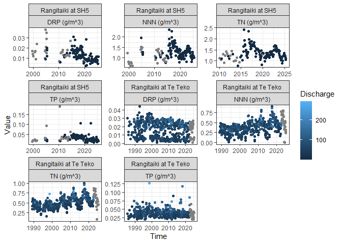
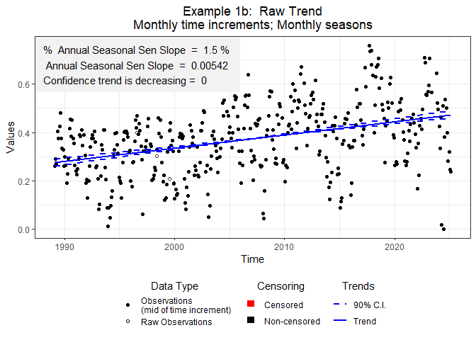

BOPRC R Tutorial 6 - Trend Analysis - Part 1
================
James Dare

------------------------------------------------------------------------

## Overview

This lesson is designed to introduce you to the ‘LWPTrends’ package.
This package is an internal package but has been built around functions
developed by Ton Snelder and Caroline Fraser from LWP. Additional
functions have been developed by me (James Dare) to make the LWP
functions more applicable to BOPRC data.

The main packages that we will use in this tutorial are:

- **tidyverse**
- **outliers**
- **plyr**
- **ggpubr**
- **NADA**
- **gam**
- **conflicted**

Before attempting to install these packages, make sure your Primary CRAN
Repository is set to:

- **“New Zealand \[https\] - University of Auckland”**

To check this, click ‘Tools’ –\> ‘Global Options’ –\> ‘Packages’. Click
‘Change’ if you need to adjust this.

You can download most packages by clicking on the ‘Install’ button on
the ‘packages’ tab in the lower right window pane. Then in the Install
Packages popup, select ‘Repository (CRAN)’ from the ‘Install from’ drop
box and type the name of the package you wish to download (e.g., dplyr).

We will also use an internal package:

<center>


</center>

LWPTrends will need to be installed manually from a tar file:

``` r
install.packages("V:/Applications/R Course/Packages/LWPTrends_1.0.0.tar.gz", repos = NULL,
    type = "source")
```

Once all of these packages are installed you can load them using the
‘library’ function:

``` r
library(tidyverse)
library(outliers)
library(plyr)
library(ggpubr)
library(NADA)
library(gam)
library(LWPTrends)
library(conflicted)
```

For those that are new to R, ‘plyr’ is the old version of dplyr, which
is part of the tidyverse. Unfortunately, the LWPTrends package relies
heavily on ‘plyr’ so we have to use it, however tidyverse uses the newer
version, ‘dplyr’. This causes problems because both packages have
functions with the same name, yet operate in different ways (remember
that conversation we had on the first day).

We will manage this problem using the ‘conflicted’ package. This package
allows us to tell R to prefer the ‘dplyr’ versions of these functions
over the ‘plyr’ versions. There are only seven conflicted functions so
it shouldn’t affect the functionality of the ‘LWPTrends’ package.

You won’t have to use the ‘conflicted’ package very often, but it
definitely helps solve the problems that occur when you try to use
‘tidyverse’ and ‘LWPTrends’ at the same time.

``` r
conflict_prefer("summarise", "dplyr")
conflict_prefer("mutate", "dplyr")
conflict_prefer("arrange", "dplyr")
conflict_prefer("mutate", "dplyr")
conflict_prefer("rename", "dplyr")
conflict_prefer("select", "dplyr")
conflict_prefer("summarise", "dplyr")
conflict_prefer("filter", "dplyr")
```

Today we will be looking at two different datasets which we will use to
run two different variants of trend analysis. We will start with a
simple example of annual Macroinvertebrate Community Index data from
‘Waiari at Te Puke Highway’, before moving on to a monthly NNN dataset
from Rangitaiki at Te Teko. We will use the latter to demonstrate
seasonal and co-variate (flow) adjustment. Both datasets can be found in
the ‘Datasets’ folder.

  

## Macroinvertebrate Data

Let’s start by loading the macroinvertebrate dataset:

``` r
MCI_Data <- read.csv("./Datasets/MCI_Waiari.csv")
```

Open up the dataset by double clicking on the ‘MCI_Data’ object in the
data panel (upper right corner). Notice that there are no date or time
stamps. We only have a ‘Period’ to work with. Trend analysis requires a
time stamp, so let’s convert the period into a date where we assume the
sample is collected on the 1st January each year. First we need to
create a column called ‘Year’ which takes the first 4-digit component
from the ‘Period’ string. The substring function allows you to subset a
string, you just need to provide a point to start and end. In this case,
we want to start at the 1st character and end at the 4th character.

If we take ‘Year’ in this way, the number will represent the year that
the survey began. We really want an arbitrary date in the middle of the
sampling season so let’s convert the string to a numeric and add 1 to
get the correct year for a mid-season Jan-1st date.

``` r
MCI_Data <- MCI_Data %>%
    mutate(Year = as.numeric(substring(Period, 1, 4)) + 1)
```

Open up MCI_Data and take a look. You should see a new column called
‘Year’ which shows the first 4 digit component of the ‘Period’ column
with 1 added to it.

Now we need to convert the year into a date object where the day and
month will be ‘01-01’ i.e., the 1st of January. We need to create a new
column called ‘myDate’ formatted in the correct date format, so that
‘LWPTrends’ knows which season the sample was collected in.

------------------------------------------------------------------------

***Challenge 1:*** *Create another column called ‘myDate’ which is equal
to the column ‘Year’ combined with ‘01-01’. Hint - you will need to do
this in two steps. First create a string using the ‘paste0()’ function
which combines the Year column with the string ‘01-01’. Secondly,
convert that string to a Date using as.Date(). You can do all of this in
one line of code if you want!*

<details>

<summary><b>Click to see a solution</b></summary>

``` r
MCI_Data <- MCI_Data %>%
    mutate(myDate = as.Date(paste0(Year, "-01-01"), tz = "etc/GMT+12"))
```

</details>

------------------------------------------------------------------------

Great. We only need three columns to run trend analysis, so we will use
the select() function to select the columns:
‘Aquarius.\_SIteID’,‘myDate’,‘MCI’. MCI data is the only analyte that
LWPTrends will allow an annual time-interval for, so we need to make
sure that it knows we are dealing with this type of data. LWPTrends
looks for a column called ‘analyte’ to confirm the data type, so we will
add this in using the mutate() function. The LWPTrends package requires
specific names for the timestamp (myDate) and parameter (analyte) in
order for functions to work.

Finally, we can apply the str() function we can see that we now have
four columns: ‘Aquarius.\_SIteID’,‘myDate’,‘MCI’, and ‘analyte’, which
have the class ‘chr’,‘Date’,‘num’, and ‘chr’, respectively.

``` r
MCI_Data <- MCI_Data %>%
    select(Aquarius._SIteID, myDate, MCI) %>%
    mutate(analyte = "MCI")  #create a new column called 'analyte' where every row is equal to 'MCI'

str(MCI_Data)
```

    ## 'data.frame':    18 obs. of  4 variables:
    ##  $ Aquarius._SIteID: chr  "Waiari at Te Puke Highway" "Waiari at Te Puke Highway" "Waiari at Te Puke Highway" "Waiari at Te Puke Highway" ...
    ##  $ myDate          : Date, format: "2003-01-01" "2004-01-01" ...
    ##  $ MCI             : num  101 115 119 129 102 ...
    ##  $ analyte         : chr  "MCI" "MCI" "MCI" "MCI" ...

Now we are ready to begin a series of steps to prepare the dataset for
trend analysis. There are seven generic steps that can be applied to any
trend-analysis task, each of which involves a specific LWPTrends
function.

  

1.  **Append date information to the dataset.**

The first function is ***‘GetMoreDateInfo()’***. This adds on the
necessary information that allows steps 3-6 to determine which year,
month, and quarter each date relates to.

``` r
#Add on time increment and extra date information.
MCI_Data <- GetMoreDateInfo(MCI_Data)
```

  

2.  **Process censored values.**

Now we need to apply the ***‘RemoveAlphaDetect()’*** function. This
removes all of the censored values from our dataset, i.e., all the
values that are less than or greater than the laboratory’s detection
limit. These are often seen in water quality datasets as ‘\<’ or ‘\>’
symbols before a value. Of course, MCI data is based on taxonomic
analysis so we shouldn’t see any censored values in our dataset.
Regardless, the LWPTrends package requires us to process the dataset in
the same way.

``` r
#Process censored values
MCI_Data <- RemoveAlphaDetect(MCI_Data,ColToUse="MCI")
```

This function will provide a new column ‘RawValue’ with the raw data,
alongside two additional columns that detail whether each value was
censored and what type of censor it was. Open MCI_Data to have a look
for yourself if you’re interested. This information is passed to the
trend analysis function in future steps.

The LWPTrends package handles censored values in two ways. For point
statistics such as means, standard deviations or quantiles, left
censored values are imputed using the regression on order statistics
(ROS) method, while right censored values are imputed using the survreg
method. Censored values used to calculate Kendall’s S and its p-value
are handled in the manner recommended by Helsel (2005, 2012). Refer to
the [LWPTrends help
document](https://github.com/JamesBOPRC/LWPTrends/blob/main/Reference_Doc/LWPTrendsHelp_v2502.pdf)
for more information.

  

3.  **Inspect the data.**

Now it is time to inspect our dataset using ***‘InspectTrendData()’***.
This function will provide important diagnostic output, while also
appending the dataset with additional columns that are necessary to
continue with trend analysis. There are a number of arguments that can
be input to the InspectTrendData() function, but the one that we need to
worry about is the ‘EndYear’, ‘propYearTol’, and ‘propIncrTol’. End
year, is just the year that you want the analysis to end. This is
required, but can also be used in conjunction with ‘TrendPeriod’ to
shorten the dataset. The ‘propYearTol’, and ‘propIncrTol’ refer to the
acceptable proportion of years and time increments that must have
observations. The default for these values is 0.9, i.e., 90% of years
and time increments must have values.

Let’s run the data inspection using these defaults to see what happens.

``` r
MCI_Inspect <- InspectTrendData(MCI_Data,
                                EndYear = max(MCI_Data$Year),
                                ReturnALLincr=TRUE,
                                do.plot = TRUE,
                                mymain="Example 1",
                                UseMidObs=TRUE,
                                Year="Year",
                                propYearTol = 0.9,
                                propIncrTol = 0.9)
```

The InspectTrendData object contains three sub-objects, stored in a
special type of object class called a ‘list’. You can access sub-objects
using the syntax ‘ListName\[\[SubList_Number\]\]’. The first sub-object
is an amended dataframe, the second is the output of an analysis that
determines the best time increment to run trend analysis on, and the
third produces a series of diagnostic plots.

We need to look at the second sub-list object.

``` r
MCI_Inspect[[2]]
```

    ##      Incr TrendPeriodL nobs nYear  propYear nIncrYear propIncrYear propCen
    ## 1   Month           21   18    18 0.8571429        18   0.07142857       0
    ## 2 BiMonth           21   18    18 0.8571429        18   0.14285714       0
    ## 3     Qtr           21   18    18 0.8571429        18   0.21428571       0
    ## 4   BiAnn           21   18    18 0.8571429        18   0.42857143       0
    ## 5    Year           21   18    18 0.8571429        18   0.85714286       0
    ##   nCenLevelsLT nCenLevelsGT nFlow DataOK
    ## 1            0            0     0  FALSE
    ## 2            0            0     0  FALSE
    ## 3            0            0     0  FALSE
    ## 4            0            0     0  FALSE
    ## 5            0            0     0  FALSE

This output shows the possible time increments in the leftmost column,
followed by a range of other column outputs. Notice the final column
‘DataOK’ states FALSE for all time increments, which is essentially
saying that we don’t have enough data to satisfy any of the condtions
for any time increment. Take a look at the ‘propYear’ and ‘propIncrYear’
columns and not the values. Any thoughts on why his might have failed?

This might make more sense if we look at the diagnostic plots. The
complicated looking ‘ggarrange’ call below is complicated because it is
calling sub-list components directly rather than saving them as
different objects (e.g. plot1, plot2, plot3 etc.). It is also nesting a
three-plot ggarrange object as the second row of another ggplot object.
This allows you to see a large version of the time series data, and have
smaller versions of the matrix plots. This comes directly from Ton and
Caroline (don’t blame me..), but I think it makes a very handy
diagnostic dashboard. Remember that you can click on the ‘zoom’ button
in the ‘Plots’ pane to make the image bigger.

  

``` r
ggarrange(MCI_Inspect[[3]][[1]],
          ggarrange(MCI_Inspect[[3]][[2]],
                    MCI_Inspect[[3]][[3]],
                    MCI_Inspect[[3]][[4]],nrow=1,align="h"),nrow=2)
```

<!-- -->

Hopefully you can see that we have gaps in 2009, 2011, and 2012. These
gaps mean that we only have observations for 85% of years and 85% of
time increments if we run an annual trend analysis.

We have two options, either we reduce the trend analysis period to say
2013-2022, or we make proportion of observations requirement more
lenient. Let’s do the latter.

------------------------------------------------------------------------

***Challenge 2:*** *Change the propYearTol and propInrTol requirements
to 0.8 in the InspectTrendData function. Make sure this is defined as an
object named ‘MCI_Inspect’. Look at the second sub-list object to see if
anything has changed*

<details>

<summary><b>Click to see a solution</b></summary>


``` r
MCI_Inspect <- InspectTrendData(MCI_Data,
                                EndYear = max(MCI_Data$Year),
                                ReturnALLincr=TRUE,
                                do.plot = TRUE,
                                mymain="Example 1",
                                UseMidObs=TRUE,
                                Year="Year",
                                propYearTol = 0.8,
                                propIncrTol = 0.8)

MCI_Inspect[[2]]
```

    ##      Incr TrendPeriodL nobs nYear  propYear nIncrYear propIncrYear propCen
    ## 1   Month           21   18    18 0.8571429        18   0.07142857       0
    ## 2 BiMonth           21   18    18 0.8571429        18   0.14285714       0
    ## 3     Qtr           21   18    18 0.8571429        18   0.21428571       0
    ## 4   BiAnn           21   18    18 0.8571429        18   0.42857143       0
    ## 5    Year           21   18    18 0.8571429        18   0.85714286       0
    ##   nCenLevelsLT nCenLevelsGT nFlow DataOK
    ## 1            0            0     0  FALSE
    ## 2            0            0     0  FALSE
    ## 3            0            0     0  FALSE
    ## 4            0            0     0  FALSE
    ## 5            0            0     0   TRUE

</details>

------------------------------------------------------------------------

Hooray, the ‘Year’ time increment now has ‘TRUE’ in the ‘DataOK’ column.
We can move on, but first we need to save the appended datasets for the
next step. It’s fine to overwrite our original ‘MCI_Data’ object with
the new appended dataset because the latter is identical, aside from the
addition of a ‘TimeIncr’ column.

``` r
MCI_Data <- MCI_Inspect[[1]]
```

4.  **Check for seasonality**

We can skip this step given that we are using annual data, i.e., there
are no seasons.

5.  **Define a co-variate and test relationship.**

Again, we can skip this part given that we will not be adjusting our
data based on a co-variate. We will explore this with the WQ dataset.

6.  **Run trend analysis.**

We know that there is no seasonality in our data so we will use the
function ***‘NonSeasonalTrendAnalysis()’***. Again, this produces a list
with two sub-list items. The first is the trend analysis results, and
the second is a plot that shows you the trend analysis output in
graphical form. The graph is shown below.

``` r
MCI_Trend_Analysis_Output<-NonSeasonalTrendAnalysis(MCI_Data,mymain="Ex 1 Raw Trend",do.plot=T)

MCI_Trend_Analysis_Output[[2]]
```

<!-- -->

7.  **Classify the output.**

We can see that the trend is decreasing over time, but does this mean
that things are improving or degrading and what confidence do we have
around this? The ***‘AssignConfCat()’*** function can classify the trend
output in a number of different ways, ranging from full IPCC categories
to simplified LAWA categories. We are more familiar with the latter so
we will use the simple method.

Trend direction means different things to different analytes. For
example, an incresing trend for nitrate might be a bad thing, but an
increasing trend for clarity might be a good thing. Therefore we need to
tell this function what analyte we just analysed, and what analytes
should be interpreted in reverse. The default reverse analytes for this
function are ‘MCI’ and ‘CLAR’, which means that we just need to tell the
function that we are dealing with MCI. However, for clarity we will
include ‘Reverse’ in the function arguments. Again, it is looking for
the ‘analyte’ column, which has dropped off in the trend analysis
process and needs to be recreated.

We will use this function to create a new column called ‘Direction’
which will contain the trend analysis category.

``` r
MCI_Trend_Analysis_Output <- MCI_Trend_Analysis_Output[[1]]
MCI_Trend_Analysis_Output$analyte <- "MCI"

MCI_Trend_Analysis_Output <-MCI_Trend_Analysis_Output %>% 
  mutate(Direction = AssignConfCat(MCI_Trend_Analysis_Output,CatType="Improve",Reverse=c("MCI")))

MCI_Trend_Analysis_Output
```

    ##   nObs nTimeIncr   S VarS   D        tau         Z          p         C
    ## 1   18        18 -83  697 153 -0.5424837 -3.105971 0.00189655 0.9990517
    ##          Cd prop.censored prop.unique no.censorlevels TimeIncr    SeasIncr
    ## 1 0.9990517             0           1               0   Annual NonSeasonal
    ##     Median AnnualSenSlope   Sen_Lci    Sen_Uci AnalysisNote
    ## 1 108.7808      -1.267192 -1.938432 -0.6354775           ok
    ##   Percent.annual.change TrendDirection analyte             Direction
    ## 1             -1.164904     Decreasing     MCI Very likely degrading

Look in the last column and we can see that the trend is ‘Very likely
degrading’.

Congratulations, you have just completed your first trend analysis using
the LWPTrends package. Although the data and methods may change, the
general proceedure remains the same. Just remember the seven step
process:

1.  Append date information.
2.  De-censor the data.
3.  Inspect the data.
4.  Check seasonality.
5.  Adjust for co-variates.
6.  Analyse.
7.  Classify.

Now for something a bit more challenging.

## River Water Quality Data

The next dataset contains four analytes (TN, NNN, TP, and DRP) collected
from two sites (Rangitaiki at SH5 and Rangitaiki at Te Teko) on the
Rangitaiki River.

------------------------------------------------------------------------

***Challenge 3:*** *Load the ‘DF_for_Trends.csv’ dataset as an object
named ‘WQ_Data’. Ensure that the Time column is formatted as a timestamp
using the ‘parse_date_time()’ function from previous lessons.*

<details>

<summary><b>Click to see a solution</b></summary>


``` r
WQ_Data <- read.csv("./Datasets/DF_for_Trends.csv")

WQ_Data <- WQ_Data %>%
  mutate(Time = parse_date_time(Time, orders = c("%Y-%m-%d %H:%M:%S","%Y-%m-%d"),tz="etc/GMT+12"))
```

</details>

------------------------------------------------------------------------

Let’s view the data so we can see what we are dealing with.

------------------------------------------------------------------------

***Challenge 4:*** *Create a ggplot where x=Time and y=Value and facet
this by ‘LocationName + analyte’ so we can look at all variables.
Remember to add scales = “free” so you can see the data for each facet
clearly. You can also add ‘colour=analyte’ for geom_point if you wish.*

<details>

<summary><b>Click to see a solution</b></summary>


``` r
WQ_Data %>%
  ggplot(aes(x=Time, y=Value))+
  geom_point(aes(colour=analyte))+
  theme_bw()+
  facet_wrap(~LocationName+analyte,scales="free")
```

<!-- -->
</details>

------------------------------------------------------------------------

We can also look at which points have associated discharge measurements
and if discharge seems to be increasing over time.

``` r
WQ_Data %>%
  ggplot(aes(x=Time, y=Value))+
  geom_point(aes(colour=Discharge))+
  theme_bw()+
  facet_wrap(~LocationName+analyte,scales="free")
```

<!-- -->

We might also decide that we want to remove outliers. Outliers are
difficult to remove manually, but fortunately there is a package called
‘outliers’ that can help. The function of interest within the outliers
package is called ‘scores()’ but this requires a fair bit of data
manipulation to adapt to our datasets.

But don’t fret, I have developed a function called
***‘Outliers_Z_Score()’***, contained within the LWPTrends package,
which does all the hard work for you. All you need to do is input your
dataframe in the form of “LocationName”, “Site”, “Time”, “analyte”,
“Value”, and set the probability that you are happy with. I called this
function ‘Outliers_Z_Score’ but you actually use other methods as well,
just set the ‘type’ input to one of the following: (“z”, “t”, “chisq”,
“mad”). This function can either return a dataframe of ‘outliers’ or a
dataframe of non-outlier, i.e., ‘values’.

We will use a probability of 0.99 and use a z score to define outliers
in our dataset. We can then compare this to our original dataset and
create a new variable that defines which values are outliers.

``` r
#run the outliers function.  This creates a dataset of outlier values
Value_Output <- Outliers_Z_Score(dataset=WQ_Data %>% select("LocationName", "Site", "Time",  "analyte", "Value"),
                                 probability = 0.99,output = "outliers",type="z")

#create a unique column so we can compare this to our original dataset.
Value_Output <-Value_Output %>%
  mutate(Unique = paste0(Site,Time,Parameter))

#create a variable in the original dataset so we can identifiy our outliers.
WQ_Data <- WQ_Data %>%
  mutate(Unique = paste0(Site,Time,analyte)) %>%
  mutate(Outlier = ifelse(Unique %in% Value_Output$Unique, TRUE, FALSE)) %>%
  select(Site, LocationName,Time,analyte,Value,Discharge,Outlier)

#create a plot so we can visualise our outliers.
WQ_Data%>%
  ggplot(aes(x=Time, y=Value))+
  geom_point(aes(colour=Outlier))+
  theme_bw()+
  facet_wrap(~LocationName+analyte,scales="free")
```

<!-- -->

The blue dots in the figure above show which points have been identified
as an outlier.

------------------------------------------------------------------------

***Challenge 5:*** *Try other outlier detection methods by changing the
‘type’ argument. When you’re happy, use filter() to remove these
outliers from the dataset. Make sure you re-define the output as
WQ_Data*

<details>

<summary><b>Click to see a solution</b></summary>


``` r
#run the outliers function.  This creates a dataset of outlier values
Value_Output <- Outliers_Z_Score(dataset=WQ_Data %>% select("LocationName", "Site", "Time",  "analyte", "Value"),
                                 probability = 0.99,output = "outliers",type="chi")

#create a unique column so we can compare this to our original dataset.
Value_Output <-Value_Output %>%
  mutate(Unique = paste0(Site,Time,Parameter))

#create a variable in the original dataset so we can identifiy our outliers.
WQ_Data <- WQ_Data %>%
  mutate(Unique = paste0(Site,Time,analyte)) %>%
  mutate(Outlier = ifelse(Unique %in% Value_Output$Unique, TRUE, FALSE)) %>%
  select(Site, LocationName,Time,analyte,Value,Discharge,Outlier)

#create a plot so we can visualise our outliers.
WQ_Data%>%
  ggplot(aes(x=Time, y=Value))+
  geom_point(aes(colour=Outlier))+
  theme_bw()+
  facet_wrap(~LocationName+analyte,scales="free")
```

<!-- -->

``` r
WQ_Data <- WQ_Data %>%
  filter(Outlier == FALSE) %>%
  select(Site, LocationName,Time,analyte,Value,Discharge)
```

</details>

------------------------------------------------------------------------

Okay, good job. To make things a bit simpler for the next part we will
only look at one site and one variable. We will come back to look at the
other sites and variables another time when we learn how to batch
process trend data (Trend Analysis - Part 2).

Let’s work with NNN at Rangitaiki at Te Teko.

``` r
NNN_Te_Teko <- WQ_Data %>% 
  filter(LocationName == "Rangitaiki at Te Teko") %>% 
  filter(analyte == "NNN (g/m^3)")
```

Now we can begin the same process as before:

  

1.  **Append date information to the dataset.**

2.  **Process censored values.**

------------------------------------------------------------------------

***Challenge 6:*** *See if you can complete steps 1 and 2 for the
NNN_Te_Teko dataset. Remember, the timestamp needs to be converted to a
date with the name ‘myDate’*

<details>

<summary><b>Click to see a solution</b></summary>


``` r
NNN_Te_Teko <- NNN_Te_Teko %>% 
  mutate(myDate = as.Date(Time,tz="etc/GMT+12")) %>% 
  GetMoreDateInfo() %>% 
  RemoveAlphaDetect(ColToUse="Value")
```

</details>

------------------------------------------------------------------------

3.  **Inspect the data.**

Okay, now lets inspect the data to see what we are dealing with.

``` r
Inspect_Output_NNN_Te_Teko <- InspectTrendData(NNN_Te_Teko, EndYear = max(NNN_Te_Teko$Year),
                                           ReturnALLincr=TRUE,do.plot = TRUE,mymain="Example 1",UseMidObs=TRUE)

#note the same nested structure.
ggarrange(Inspect_Output_NNN_Te_Teko[[3]][[1]],
          ggarrange(Inspect_Output_NNN_Te_Teko[[3]][[2]],
                    Inspect_Output_NNN_Te_Teko[[3]][[3]],
                    Inspect_Output_NNN_Te_Teko[[3]][[4]],nrow=1,align="h"),nrow=2)
```

<!-- -->

Okay. We can see that we have a few gaps and a few duplicates but
nothing too bad. LWPTrends handles duplicate values within each time
increment by taking the value that is closest to the mid-point of that
increment. You can also tell it to take the median if you want.

If we look at the second sub-list item we can see that all time
increments are satisfied by looking at the column ‘DataOK’. The output
will allocate the time increment as the most frequent increment that
satisfies all requirements, in this case ‘month’.

``` r
Inspect_Output_NNN_Te_Teko[[2]]
```

    ##      Incr TrendPeriodL nobs nYear propYear nIncrYear propIncrYear propCen
    ## 1   Month           37  826    37        1       420    0.9459459       0
    ## 2 BiMonth           37  826    37        1       215    0.9684685       0
    ## 3     Qtr           37  826    37        1       145    0.9797297       0
    ## 4   BiAnn           37  826    37        1        73    0.9864865       0
    ##   nCenLevelsLT nCenLevelsGT nFlow DataOK
    ## 1            0            0     0   TRUE
    ## 2            0            0     0   TRUE
    ## 3            0            0     0   TRUE
    ## 4            0            0     0   TRUE

Let’s take the appended dataset created by the InspectTrendData function
(sub-list item 1) and move to step 4.

``` r
NNN_Te_Teko <- Inspect_Output_NNN_Te_Teko[[1]]
```

  

4.  **Check for seasonality.**

Our time increment for NNN_Te_Teko is monthly so it’s highly likely
there could be some seasonality in the data (i.e., some months could
have higher concentrations than others due to climatic or anthropogenic
factors). If the data are seasonal, we need to use a different trend
analysis function than for non-seasonal data. But how do we determine if
the data are seasonal? LWPTrends has a function for that called
***‘GetSeason()’***. GetSeason performs a Kruskal Wallis
(non-parametric) test on the observations using the time increment as
the explainatory variable. Use of this function is simple, you just need
to input the dataset and tell it which column to look at.

``` r
Season_Output<-GetSeason(NNN_Te_Teko,ValuesToUse = "RawValue",mymain="Example 1",do.plot = TRUE)
```

This function outputs another list object with three sub-list
components: 1) an appended dataset, 2) the output from the
Kruskal-Wallis test, and 3) a graph showing the output.

------------------------------------------------------------------------

***Challenge 7:*** *Look at sub-list components 2 and 3 and come to a
conclusion of whether the data is seasonal or not.*

<details>

<summary><b>Click to see a solution</b></summary>


``` r
Season_Output[[2]]
```

    ##                            Observations   KWstat       pvalue SeasNote TimeIncr
    ## Kruskal-Wallis chi-squared          826 149.7574 1.670623e-26       ok  Monthly
    ##                             Season
    ## Kruskal-Wallis chi-squared Monthly

``` r
#The Kruskal-Wallis test has a p value of 1.670623e-26 which means the data is highly seasonal.

Season_Output[[3]]
```

<!-- -->

``` r
#This figure shows it nicely - it looks like nitrate concentrations peak over the winter months and are their lowest in summer. 

#We need to run a seasonal trend analysis.
```

</details>

------------------------------------------------------------------------

5.  **Define a co-variate and test relationship.**

Okay, we know the data is seasonal, but could this be caused by
seasonality in a co-variate, e.g. river discharge or rainfall? This is
where co-variate adjustment comes in handy. The LWPTrends package allows
us to determine the relationship between our observations and a
potential co-variate, and then adjust our final values based on the
values of the co-variate. For example, the concentration of an analyte
is often related to discharge in rivers as this usually means there has
been rainfall and mobilisation of contaminants sourced from the land. If
this was the case, then any trends we find in our data could actually be
caused by changes in river discharge rather than increased losses or
loading from within the catchment.

With that being said, Snelder et al. (2021) **do not recommend using
flow adjusted trends for regional applications** (i.e., assessing and
reporting trends across many sites and variables in the context of
regional state of environment reporting). They state that the purpose of
flow-adjustment is to remove the confounding effect of flow so that the
pattern of interest (the relationship between the observed water quality
observations and time i.e., the trend) can be more confidently inferred.
However, the definition of models describing observations of
instantaneous flow is subjective and therefore there are unquantified
uncertainties that arise due to procedural choices around flow
adjustment that are likely to be made by individual analysts.
Furthermore, there is evidence that trends are often associated with
changes in the relationship between concentration and flow through the
trend’s time period (Snelder and Kerr, 2022). However, flow adjustment
(based on defining a relationship between observations and instantaneous
flow) assumes that the concentration - flow relationship is constant
through time. Violations of this assumption will affect the robustness
of flow adjustment.

So in short, it’s complicated and somewhat subjective as to whether you
should actually adjust values by discharge or not. But for the sake of
this lesson, we will continue with the adjustment process using river
discharge as a co-variate. The function we will use is called
***‘AdjustValues()’*** and there is a long list of possible inputs that
we can change. Luckily, most of these have default values so we don’t
really need to worry about them. We do, however, need to provide the
dataset (referred to a ‘x’ - NNN_Te_Teko), the column that contains the
values (referred to as ‘ValuesToAdjust’ - RawValue), and the column that
contains the covariate (referred to as ‘Covariate’ - Discharge).

``` r
#take the seasonally appended dataset
NNN_Te_Teko <- Season_Output[[1]]


CV_Output<-AdjustValues(NNN_Te_Teko, method = c("Gam", "LogLog", "LOESS"), ValuesToAdjust = "RawValue", Covariate = "Discharge", Span = c(0.7), do.plot =T, plotpval=T, mymain="Example 1a")
```

AdjustValues() produces yet another list object, but this time there are
only two sub-list components: 1) a dataset of model performance (note
that this is NOT an appended dataset), and 2) a plot of the different
models.

Let’s look at component 2 first.

``` r
CV_Output[[2]]
```

<!-- --> We can
see that all models are technically significant (p\<0.05). However, some
models look better than others. The LogLog (green) model doesn’t appear
to represents this releationship as well as the Gam or LOESS models. The
Gam and LOESS models are close, but the LOESS model seems to provide
better representation at lower flows. We can also see the R2 values in
the plot legend, which align with our visual assessment, i.e., Gam and
LOESS have an R2 of 0.23, i.e., discharge explains 23% of the variance
in NNN concentrations.

We might decide that 23% is a significant amount, and that we need to
address this. Let’s take the LOESS model, and we will also plot up the
new dataset to see what our new flow adjusted points look like. As
mentioned above, flow adjustment is not recommended for regional data,
therefore LWP have not made the output from the AdjustValues function
fit seamlessly into the next step. Therefore, we need to do some tidying
up before we can move on. Let’s tidy up this output and plot the new
adjusted values to see what the look like.

``` r
#take the output from the AdjustValues function. 
CV_Adjusted_Values <- CV_Output[[1]]

#we will use the cbind (column bind) function to append on the relevant column from the CV adjusted output. 
NNN_Te_Teko <- NNN_Te_Teko %>% 
  cbind(CV_Adjusted_Values %>% select(LOESS0.7)) %>% 
  rename("Flow_Adjusted" = "LOESS0.7")

#create a time-series plot of the flow adjusted results.
P_FA <- NNN_Te_Teko %>% 
  ggplot()+
  geom_point(aes(x=myDate,y=Flow_Adjusted))+
  theme_bw()

#create a time-series plot of the raw results.
P_RD <- NNN_Te_Teko %>% 
  ggplot()+
  geom_point(aes(x=myDate,y=RawValue))+
  theme_bw()

#create a time-series plot of the discharge.
P_DC <- NNN_Te_Teko %>% 
  ggplot()+
  geom_line(aes(x=myDate,y=Discharge),colour="midnightblue")+
  theme_bw()

#combine them together in a ggarrange figure. 
ggarrange(P_RD,P_FA,P_DC,nrow=3, align = "h")
```

<!-- -->

Hmm..I will leave you to come to your own conclusion, but you can see
why Snelder et al. (2021) think flow adjustment can be subjective.

Regardless, let’s take the flow adjusted values through to the final two
steps.

  

6.  **Run trend analysis.**

We know from step 4 that we need to run a seasonal trend analysis. The
function for this is called ***‘SeasonalTrendAnalysis()’*** and we need
to tell it to use our ‘Flow_Adjusted’ column, but keep the ‘RawValue’
column for descriptive statistics. You can do this using the code below:

``` r
Trend_Analysis_Output_NNN_Te_Teko <-SeasonalTrendAnalysis(NNN_Te_Teko, ValuesToUse="Flow_Adjusted", RawValues=FALSE, ValuesToUseforMedian="RawValue", mymain="Example 1a: Flow Adjusted Trend", do.plot=T)

Trend_Analysis_Output_NNN_Te_Teko[[2]]
```

<!-- -->

  

7.  **Classify the output.**

Now we can classify the output in the same way as before (using
‘AssignConfCat’).

``` r
Trend_Analysis_Output_NNN_Te_Teko <- Trend_Analysis_Output_NNN_Te_Teko[[1]]
Trend_Analysis_Output_NNN_Te_Teko <- Trend_Analysis_Output_NNN_Te_Teko %>% mutate(analyte = "NNN")

Trend_Analysis_Output_NNN_Te_Teko$Direction <- AssignConfCat(Trend_Analysis_Output_NNN_Te_Teko,CatType="Improve",Reverse=c("VC"))

Trend_Analysis_Output_NNN_Te_Teko
```

    ##   nObs nTimeIncr    S  VarS    D         tau         Z        p         C
    ## 1  800       412 -290 57074 6910 -0.04196816 -1.209703 0.226393 0.8868035
    ##          Cd prop.censored prop.unique no.censorlevels TimeIncr SeasIncr Median
    ## 1 0.8868035             0         0.5               0  Monthly  Monthly 0.3735
    ##   AnnualSenSlope      Sen_Lci      Sen_Uci AnalysisNote Percent.annual.change
    ## 1  -0.0004142955 -0.001240764 2.973935e-05           ok            -0.1109225
    ##   TrendDirection analyte        Direction
    ## 1     Decreasing     NNN Likely improving

Whew. We finally have a result. You can see that NNN is ‘Likely
improving’ between 1990 and 2025. Interesting, this is very different to
the obvious visual trend in the raw data.

------------------------------------------------------------------------

***Challenge 8:*** *What would the result be if we took our un-adjusted
values instead of our flow-adjusted values? Which version do you think
is more appropriate?*

<details>

<summary><b>Click to see a solution</b></summary>


``` r
Trend_Analysis_Output_NNN_Te_Teko_Raw <-SeasonalTrendAnalysis(NNN_Te_Teko, ValuesToUse="RawValue", ValuesToUseforMedian="RawValue", mymain="Example 1a: Flow Adjusted Trend", do.plot=T)

Trend_Analysis_Output_NNN_Te_Teko_Raw[[2]]
```

<!-- -->

``` r
Trend_Analysis_Output_NNN_Te_Teko_Raw <- Trend_Analysis_Output_NNN_Te_Teko_Raw[[1]]
Trend_Analysis_Output_NNN_Te_Teko_Raw <- Trend_Analysis_Output_NNN_Te_Teko_Raw %>% mutate(analyte = "NNN")

Trend_Analysis_Output_NNN_Te_Teko_Raw$Direction <- AssignConfCat(Trend_Analysis_Output_NNN_Te_Teko_Raw,CatType="Improve",Reverse=c("VC"))

Trend_Analysis_Output_NNN_Te_Teko_Raw
```

    ##   nObs nTimeIncr    S     VarS    D       tau        Z            p C
    ## 1  826       420 2712 59795.33 7154 0.3790886 11.08654 1.458258e-28 1
    ##             Cd prop.censored prop.unique no.censorlevels TimeIncr SeasIncr
    ## 1 7.291291e-29             0   0.3474576               0  Monthly  Monthly
    ##   Median AnnualSenSlope     Sen_Lci     Sen_Uci AnalysisNote
    ## 1 0.3755    0.005538401 0.004753135 0.006391111           ok
    ##   Percent.annual.change TrendDirection analyte             Direction
    ## 1               1.47494     Increasing     NNN Very likely degrading

The un-adjusted trend would be ‘Very likely degrading’.

</details>

------------------------------------------------------------------------

Well, that’s it for this lesson but we have only covered half of the
trend analysis content. I will try to develop a follow up lesson (Trend
Analysis - Part 2) where we use the rest of the WQ_Data dataset to look
at batch processing.
